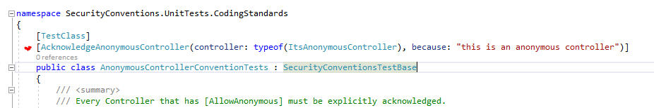

# net-controller-security-conventions
It is common practice for developers to add or remove the [AllowAnonymous] or [Authorize] attributes from controllers and action methods when developing or testing locally so the merry dance of authorization is not required. 

This is a security hazard: many, many times in my career I have seen these ad-hoc changes make it thru PRs to production. It happens. And its easy to prevent using Static Analysis implemented using unit tests.

The goal is a strategy to prevent insecure changes - likely as a result of ad-hoc local development hacks - making it through to production accidentally. This repository shows one such strategy.

## Solution
The API/MVC project contains the controllers, action methods and their security attributes [AllowAnonymous], [Authorize]. This is the same as every other API/MVC project. 

The unit test project contains a specification of permitted insecure controllers and action methods - in particular: areas that would likely be changed to support ad-hoc local development. The specification is implemented by attributes that act as an 'acknowledgement' that certain settings are insecure.

Unit tests will fail if there are any API controllers or action methods that are LESS secure than the permitted specification. For example: 

### Implementation
The unit test project takes a reference to the API project so that the controllers and action methods can be accessed using reflection. Accidental insecure ad-hoc changes to the controllers and action methods to support local development will fail the unit tests and prevent the completion of PR's; a conscious decision must be made whenever the controllers and action methods are made less secure by acknowledging that insecurity, using an attribute, and updating the unit tests. Only then will the unit tests pass. 

CODEOWNERS can be used to add mandatory approvers when the unit tests are changed; this means that insecure changes must be approved by a qualified party thereby reducing the likelihood further of insecure changes making it to production. 

## Scenarios
The following scenarios are covered by the tests: the implementation is far simpler than you would think by looking at this! 

### New Scenarios
The following scenarios will arise during new development:
| Scenario | Description | 
| -------- | ----------- |
| Developers add a new controller but do not specify security | Every controller *MUST* be tagged with [Authorize] or [AllowAnonymous]  Tests: ControllerConventionTests |
| Developers add a new [AllowAnonymous] controller | The new controller must be acknowledged in the tests using [AcknowledgeAnonymousController] attribute.   CODEOWNERS can be used so that a security owner is aware of anonymous functionality getting onto the code base. CODEOWNERS applies to all scenarios here so will not be repeated again. |
| Developers add a new [Authorize] controller | No impact | 
| Developers add an [Authorize] method to an anonymous controller | The authorized methods must be acknowledged in the tests with a [AcknowledgeAuthorizedActionMethod] attribute.   This acknowledgement will prevent the accidential removal of the authorization attribute in future (which would make the method inherit the insecurity of its parent controller) |
| Developers add an [AllowAnonymous] method to an authorize controller | The anonymous method must be acknowledged in the tests with a [AcknowledgeAnonymousActionMethod] attribute.   This acknowledgement will prevent insecure methods in otherwise secure controllers accidentally making it to production |

### Change/Modification Scenarios
The following scenarios will arise when modifying existing code; or developing locally:
| Scenario | Description | 
| -------- | ----------- |
| Developers remove [Authorize] from a controller | Every controller *MUST* be tagged with [Authorize] or [AllowAnonymous]  Tests: ControllerConventionTests |
| Developers change a controller from [Authorize] to [AllowAnonymous] | Every anonymous controller *MUST* be acknowledged with an attribute in the tests.   Tests: AnonymousControllerConventionTests |
| An anonymous controller has an [Authorize] method.   The developer removes [Authorize] to test locally | As action methods inherit the authorization rules of their parent controller by default, commenting out [Authorize] on a method makes it insecure. Therefore, every [Authorize] method in an anonymous controller must be explicitly acknowledged.   Tests: ActionMethodConventionTests |
| An [Authorize] controller has a [AllowAnonymous] method.   The developer adds a new [AllowAnonymous] attribute for local development on a particular method but forgets to remove it | As action methods inherit the authorization rules of their parent controller by default, commenting out [AllowAnonymous] will implicitly make the methods require secure. Adding [AllowAnonymous] for local testing (and forgetting to remove it) will make the method less secure. Therefore, every [AllowAnonymous] method in an authorized controller must be explicitly acknowledged   Tests: ActionMethodContentionTests |

### Deletion Scenarios
The following scenarios will arise when deleting code (a rename of a method will likely appear as a deletion depending on how you refactor):
| Scenario | Description | 
| -------- | ----------- |
| An acknowledged anonymous controller is deleted | Every acknowledged controller MUST exist.   Tests: AnonymousControllerConventionTests |
| A [AllowAnonymous] method in a [Authorize] controller is deleted or renamed | Every acknowledged anonymous method must exist.   Tests: ActionMethodConventionTests |
| A [Authorize] method in a [AllowAnonymous] controller is deleted or renamed | Every acknowledged authorized method must exist.   Tests: ActionMethodConventionTests |
| An [Authorize] controller is deleted | No impact |

## Considerations
The naive solution to this problem is to require an acknowledgement of every single controller and anonymous method in the tests (secure or anonymous): this does not scale and is not a good experience. Rather: the solution in this repository prevents accidental drift of the most common scenarios. 

Personal preference: it is better to design security around controllers instead of methods. The scenarios above - whereby an authorized controller can have an anonymous method; or an anonymous controller can have an authorized method - can ideally be designed out of the system. In such a case, a test can be written to ensure that every authorized controller contains no anonymous methods; and that every anonymous controller contains no authorized methods. This is left as an exercise for the reader. 

There is a test to ensure that every single controller has either [Authorize] or [AllowAnonymous] - but not a test to enforce the same for methods. Why? To simplify local development. The common practice is usually to turn off authorization at the controller level locally.

## TODO:
Currently, there are no 'dynamic' tests which ensure that an Authorization is wired up after the application is built. Maybe soon. 

Run profiles/launchSettings.json (.Net core) can be used to conditionally disable authentication and authorization. This will work in some cases; an example might come later. 

